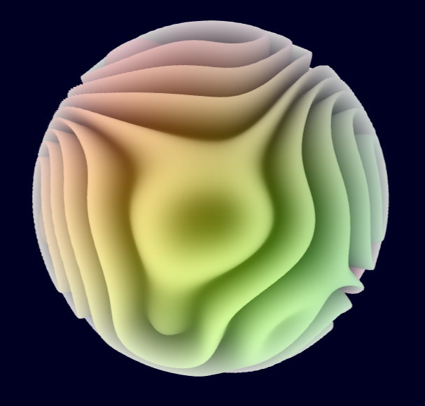
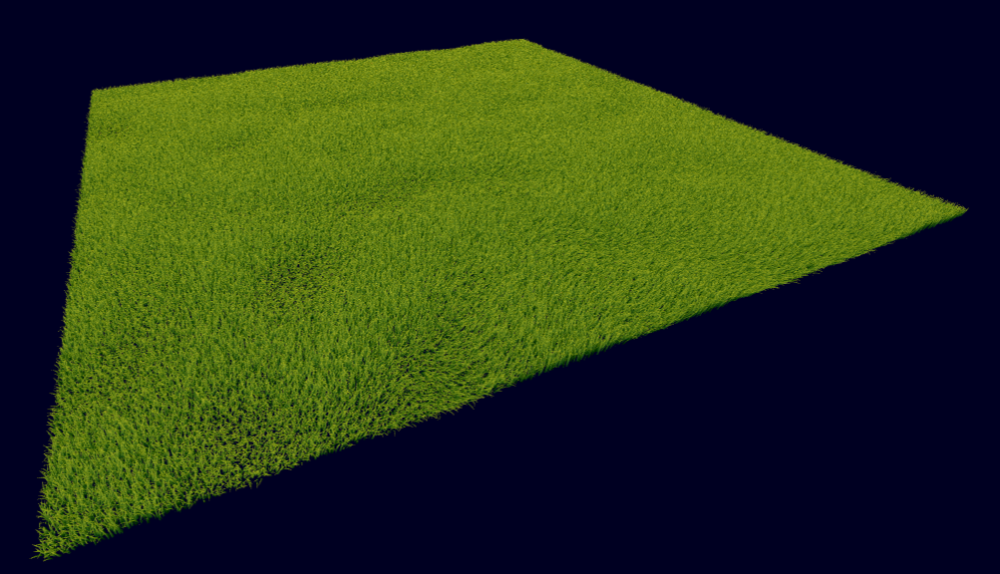
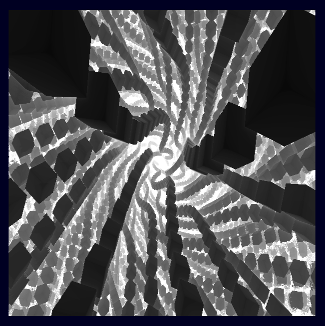
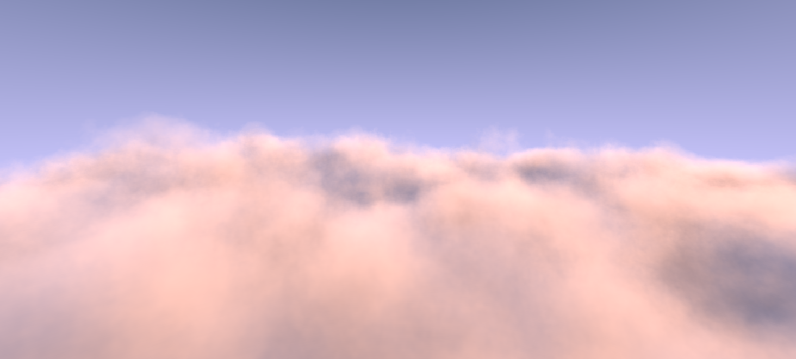
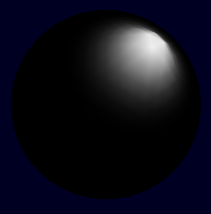

# This project consists of Miscellaneous ThreeJS Projects and Tutorials Done

The Tutorials Followed includes:
1. SimonDev's YouTube video, "[How do Major Video Games Render Grass?](https://www.youtube.com/watch?v=bp7REZBV4P4)"
2. Visionary 3D's YouTube video, "[Three.js Shaders (GLSL) Crash Course For Absolute Beginners](https://www.youtube.com/watch?v=oKbCaj1J6EI)"
3. Kishimisu's YouTube video, "[An introduction to Raymarching](https://www.youtube.com/watch?v=khblXafu7iA)"
4. Maxime Heckel's Blog on Cloudscapes, "[Real-time dreamy Cloudscapes with Volumetric Raymarching](https://blog.maximeheckel.com/posts/real-time-cloudscapes-with-volumetric-raymarching/)"

The resulting application is hosted on GitHub Pages and can be accessed here:

## What have I Achieved and Learnt through this Project

Doing these Projects were a fun hobby as I was able to explore my interest with ThreeJS and I got to learn a lot on GLSL and Shaders. I am interested in working on more similar projects in the future.

## Screenshots

### Tutorials

\
Shader Tutorial

\
Grass Tutorial

\
Raymarching Tutorial

\
Cloud Tutorial

### Projects

\
Shader Project

\
Complied Shader Project
